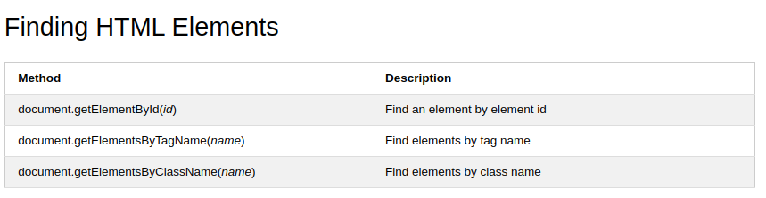

# Read: 06 - Problem Domain, JS Object Literals; The DOM

## Problem Domain
- there is two things you have to deal with it in programming:
1. problem domain
1. coding part
- you have to understand the problem before solving it.
- there is a lot of things in our world, which is make it hard to understand everything in it. as a programmer you would deal with any sort of problems. it could be problem in physics ,art, chemistry....
- you have to make sure that you are really understood the problem before even try to solve it or write any code.
- To make sure that you are understood the problem you can take advantage of the following steps:
1. listen to the costumer carefully and make sure that you understand what he exactly said
1. chunk the domain to small peaces and try to understand every chunk alone.
- make it simple as much as you can.
- don't hesitate to ask any specialist in that domain.

## JS Object Literals
- Object: group functions and variables together.
- when the function be in the object we call it method.
- when the variable be in the object we call it property.
- the following example "hotel" is the object:

- to call an property or method from object you could use two ways as you can see in the figure:

## The DOM

- DOM stands for Domain Object Model.
- The general idea in DOM is that the browser will structure the web page through what we call it DOM tree, and when you want to structure the HTML page and you want to edit in it from JavaScript file or event the user want to change in the page, we will use the idea of DOM.

- The most common way to access an HTML element is to use the id of the element.
- The easiest way to get the content of an element is by using the innerHTML property.
- following are the summery of things you could change in the HTML from JavaScript from https://www.w3schools.com.

