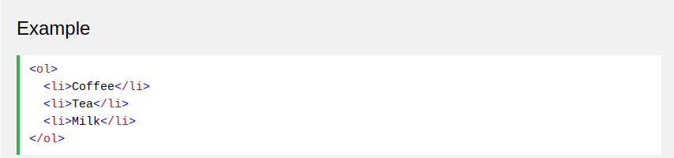
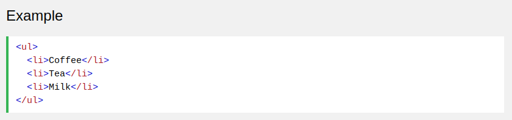
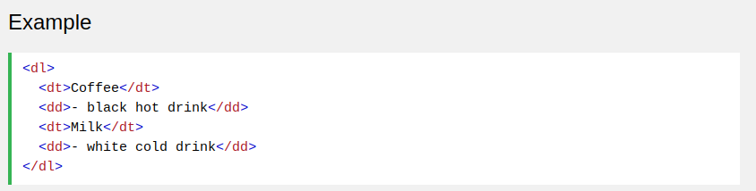
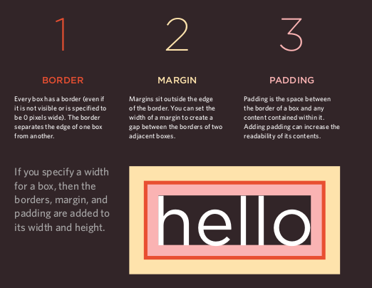

# reading from the Duckett HTML book:

## Chapter 3: “Lists” (pp.62-73)

- there is three type of lists used in html:
1. ordered list
1. unordered
1. definition
- the general form of ordered list:

- the general form of unordered list:

- the general form of unordered list:

## Chapter 13: “Boxes” (pp.300-329)

- the css deal with text like a word writen inside three boxes and all of that used to make the text clear and capable of changing, to adapt to any used area.
- ***in the follwing picture you will see the three types of boxes that chapter talk about:***

- you could use alot of way to change the three boxes like inline way or line way.
- if you want to use any order there is more than one source i recommend like:
1. [w3schools](https://www.w3schools.com/css/css3_box-sizing.asp)
2. HTML & CSS
Design and Build Websites Jon Duckett textbook

## Chapter 4: “Decisions and Loops” from switch statements on (pp.162-182)
*in this chapter i use quizing approach to make sure that i can use active learninig*

(take the quiz)[https://docs.google.com/forms/d/e/1FAIpQLSe2ytvDDb8jUngTsZgfSDNF78zzaJ6FIGWWB5oA6R6WYzceuA/viewform?usp=sf_link]