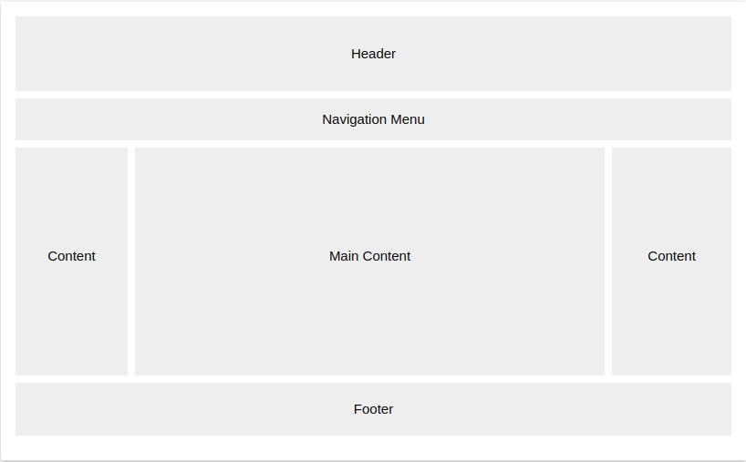

## Read: 08 - More CSS Layout

- there is to positioning elements:
1. block level elements.
1. inline elements
- parent element is the outer element of two element between each other.
- there is three positioning schemes:
1. relative positioning
1. absolute positioning
1. noraml flow
- z index can put the element on top.
- CSS Frameworks give us rules for common designs
- div element used to make multiple columns
- the float property make us take the element in normal flow and put it in elements side by side