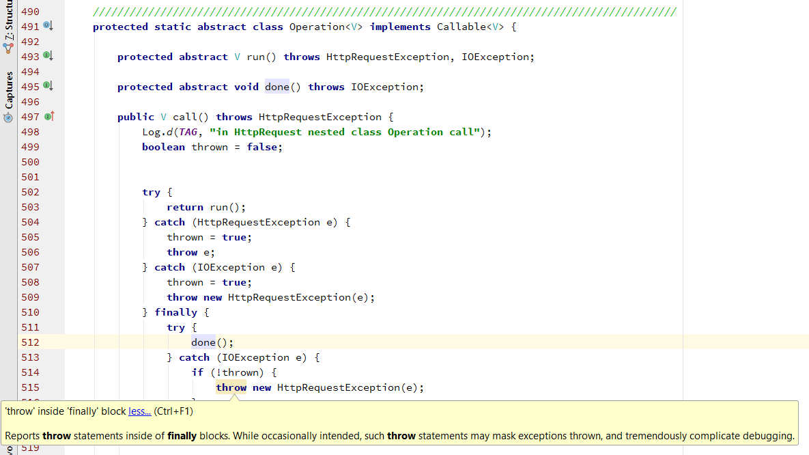

# Maps, primitives, File I/O
- there are two types we can use when dealing with variables; primitive and reference values.
- in general the primitive values take less memory in the and it will be faster to use than reference values.
- the arrays are strange in this manner, in general the arrays from reference type are more efficient.
- as a general rule use primitive always unless you have to use reference value.
- some situations you have to use reference values such as using API, collections and generics.
- we use exceptions to know if there is any error in my code. `throw` used to throw an exception.
- you have to provide a throw statement with an exception object.
- we use `try, catch, and finally` blocks to catch an error in our program.
- in a `try` statement we have to have at least one `catch` or `finally`.
- inside the`java.util` package there is a class called `scanner` used to take the user inputs.
- to use the scanner class you have at first to do a new object from this class, after that you can use it with `nameOfObjectYouDeclared.[provide-scanner-method]`
- scanner used to read a file in java.
- when we use scanner method we are usually using File class with it to make sure that the absolute path will be there with it.

- we use while loop to check if the next line is not null the scanner will read the next line, and if it's null the loop will break.

- we have to close the scanner after finshing, and we prefer to do it in final block.
- try and catch and finally blocks are used in handling exception.

- handling exception idea it's like the the idea of promises in javascript
- the code will execute the try block at first, after if it's not working it will go to catch block.
- if the code execute try or catch, in both way it will fo to finaly block.
- you can use more than catch and finally blocks, and it's called nested exceptions.
- you can the throw the exception beside decleration of function.

