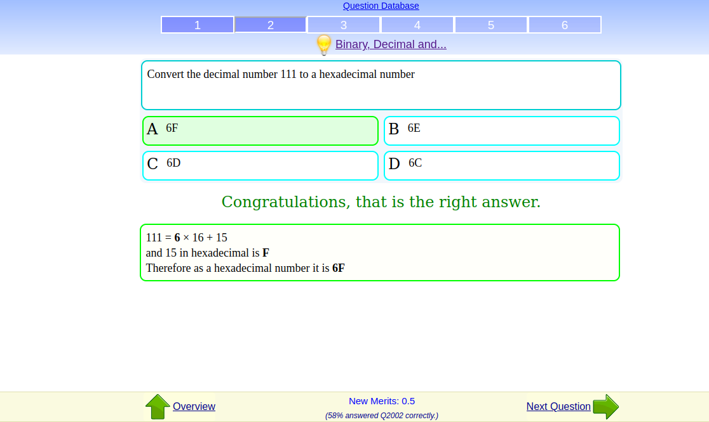

# OOP
# the tutorial answers

# OOP
What Is an Object?
- the object is a thing, you can think of object like thing have status and behavior(human,car,cat,sky...etc)
What Is a Class?
- the object is like a bluebrint that make you made object (the factory that make object)
What Is Inheritance?
- the Inheritance is something we can use to add variables or methods from class to another, and that can happen when there is common things beween the two classes.
What Is an Interface?
- it's the shown things from the method, not the internal structor of it, like the key that will turn the light on
What Is a Package?
- it's like directory include classes and interfaces ready to use from any one want to use java to code.