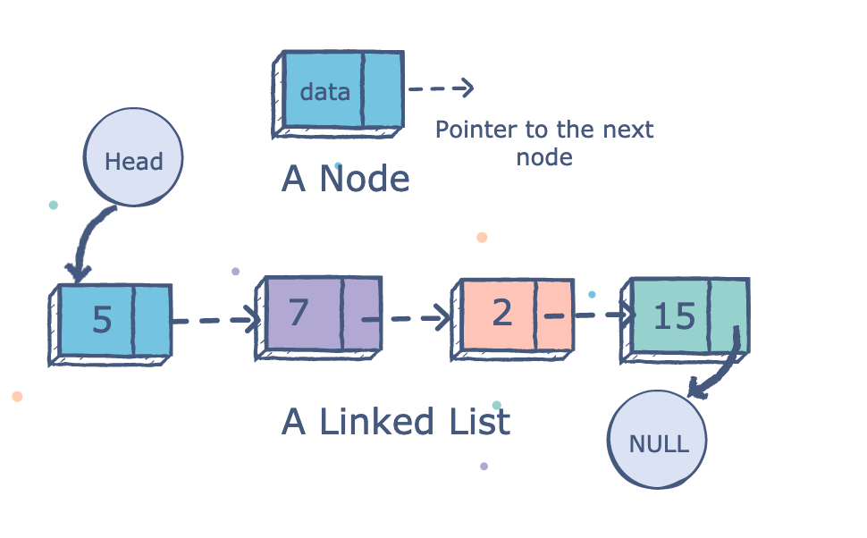

# Linked Lists

- The linked list are a linear element of data, and theire reall postion in the physical memory is not the same as theire place in the linear list.
- TO understand linked lists, you have at first unserstand that there are types of data like linear and non-linear datastructor.

- as you can see in linear data sctructor to get to last data you have to go through all steps.
- in nonLinear one, its not the case, actually you can get to data without going to every one of them to get last one.

- you can think of arrays as a linear data structor, the same thing the link lists they are linear data structor.
- the arrays store a linear data besides each other and that even inside the memory, the bolcks that contain each data have to be beside each other, in the another hand the linked lists not like that, every element data can be stored in any place in memory.
- as you can understand from previous point the array have fixed ammount of data and it's not change unless you made the array from scratch with new data, but link lists you can add and remove data from it, and here you can see there is more types of data structors wich is dynamic data structor and static data structor.
- the linked lists have to parts, refrences `head=>refered to start of lists and null=>refered to end of lists`
- the nodes which the place that had to things: 1. the data
2. refrence for the next data
- there is three types of linked lists:
  - singly linked lists
  - doubly linked lists
  - circular linked lists

