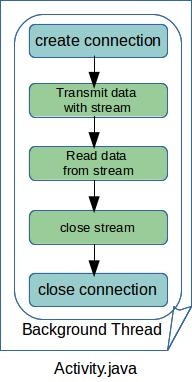
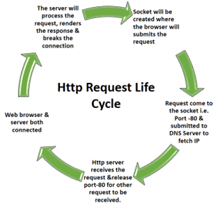

# WRRC and Java

- the way we can perform HTTP request in java is by using built in class called `HttpUrlConnection`.
- the disadvantage using HttpUrlConnection:
   - it's slow writing and long relativly and it don't have extra functionallity of security.
- Creating a requset can done in three steps:
   - make HttpUrlConnection
   - adding method called openConnection
   - adding the type of request you want   
```
URL url = new URL("http://example.com");
HttpURLConnection con = (HttpURLConnection) url.openConnection();
con.setRequestMethod("GET");
```
- if we want to add a prameter to request we set doOutput property to true.
- we add header to request by `setRequestProperty()`
- to make a time out to connect to server you can use `setConnectTimeout() and setReadTimeout() methods`
- acually the procedure in dealing with requests is clear, and you see more source here:
  - (1)[https://www.baeldung.com/java-http-request]
  - (2)[https://github.com/eugenp/tutorials/tree/master/core-java-modules/core-java-networking-2]
  
  - in general the HTTP Request Lifecycle:
     - Local Processing
     - Resolve an IP
     - Establish a TCP Connection
     - Send an HTTP Request
     - Tearing Down and Cleaning Up