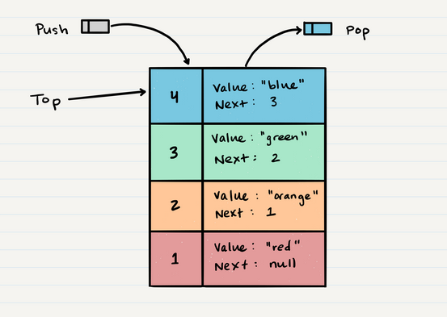
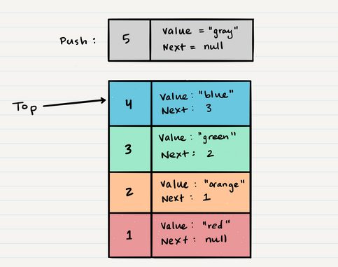
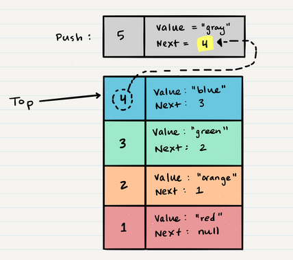
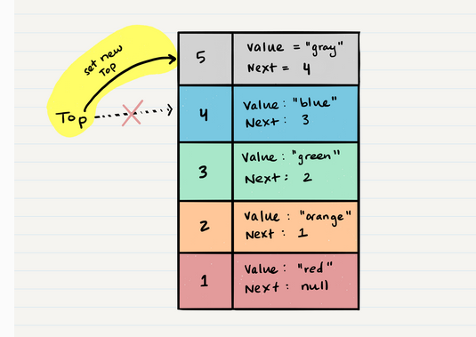
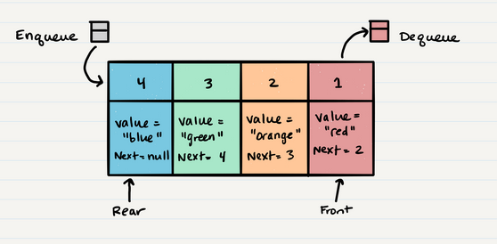

# Stacks and Queues
- the stack is data structor contains of Nodes.
- every node has a refrence for the next one.
- five consepts you have to knoe in stack:
    - push: adding item to the stack
    - pop: removing item to the stack
    - top: the top item in the stack
    - peak: give me the item is in top of the stack
    - IsEmpty: give me a boolean true if the stack is empty.
- FILO and LIFO principle in stack are:
1. First In Last Out: the first item push to stack will be the last item pop form the stack
1. Last In First Out: the last item push to stack will be the first item pop form the stack

- the big O adding push data to stack is O(1), because it doesn't matter how much nodes in the stack
- the top.next will point to the element in bottom of it.
- in the following image you will see a visualization of how to add node to the top of stack:

- to pop the top value you have to do the following:
1. make newNode called temp, and put the top node to it
1. make the top node equal to top.next
1. make the temp.next =null
1. return the temp.value
- the Big O of poping stack is O(1)
- finding the peak is traight forward it just returning the top.value
- the queues differ from the stack that the first in will be the first out and the last in the last out
