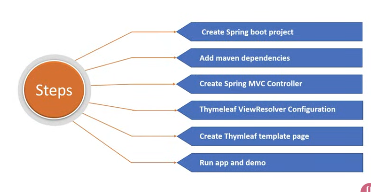
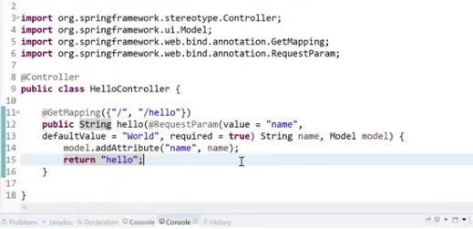

# Spring
- In Java we will use Spring MVC framework to do the back end
- In java script we used "EJS" as template engine, in Java we will use "Thymeleaf"
- MVC stands for => Model View Controller

- model attributes in Spring MVC = context variables in Thymeleaf
- we can add attribute to model in spring thorow addattribute method
- every message attributes will be added to the model and we can access it from thymeleaf template.
- if the params is not exist and you want to access it you get an empty string
- if my params have multi values i can use brackets to acces it all
- if you try to access multivalued params with single access you will get a serialize array.
- the Attribute is: not standard class in java
- you can get the access 
## to create an hellow world application with spring you have to do the following:
*source:*  [Spring Boot Thymeleaf Hello World Example Tutorial](https://www.youtube.com/watch?v=-tmu1GJlQb8)

- make an spring opject from new project
- add the depencies we need to our project
- adding a package controller
- add a class controller
- Add `@ Controller` before the class
- add `@getMapping` and after that add the method tha will show my the "Hello World"
- after that we will add the params name and its value, and return worlk `Hello`
- for model we will set the attrebute

- adding the files like template in the resources, and make a file.html inside it, our varibale name will be in `{}`
- run the application 
- access it from the local host from the browser
