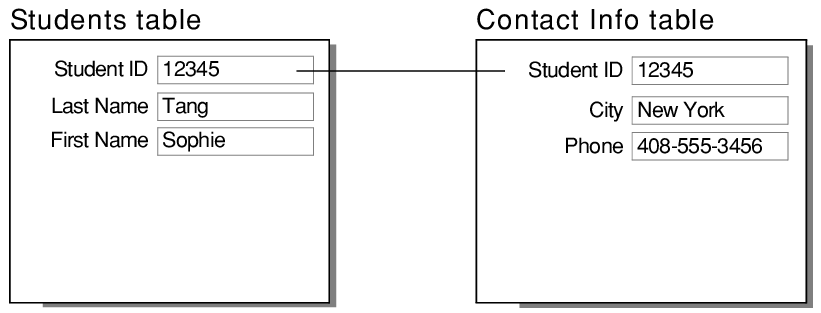
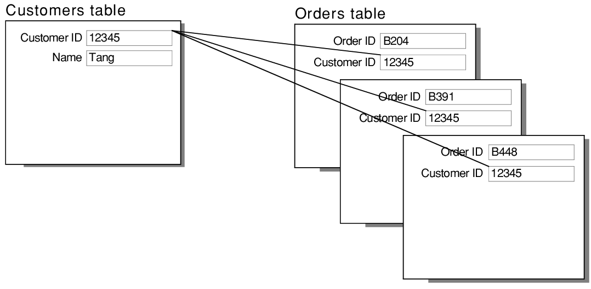
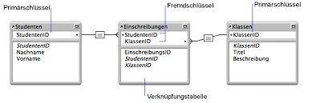

# Related Resources and Integration Testing
## there is three relations between the datRest {one to one, tone to many, many to many}
### One-to-One Relationship:

- The Data Model:
   - adding @RestResource in optional
   - we msut have differnet names for each sassociation resource
- The Repositories :
   - to expose the entities as resources you have to creace repositroy interfacess for each one of them
- Creating the Resources :   
   - adding instacne for one class of them
   - the api will return a JSON object
   - if we did a get request befor doing the association the object that will returned will be empty
- Creating the Associations :  
   - after doing the two instances we can make a relation beween them using association resources like using PUT method
   - we add an adress to to one of the classes
   - to remove the association we use DELETE methdo of HTTP
### One-to-Many Relationship:


- there is @OneToMany and @ManyToOne annotations
- one to many relation have alot of examples like the book and libray
- in one to many relation we will get from jason file an array of items
### Many-to-Many Relationship :

- its @ManyToMany annotation
- the key consept in dealing wihth relationship is understanding the relation beween the classes in real life, and in coding the difference will be in syntax
- dealing with it is the same concsept with the prepvious relationship, the the difference just in the syntax. 
### Testing :
- first creating test class 
```
@RunWith(SpringRunner.class)
@SpringBootTest(classes = SpringDataRestApplication.class, 
  webEnvironment = WebEnvironment.DEFINED_PORT)
public class SpringDataRelationshipsTest {

    @Autowired
    private TestRestTemplate template;

    private static String BOOK_ENDPOINT = "http://localhost:8080/books/";
    private static String AUTHOR_ENDPOINT = "http://localhost:8080/authors/";
    private static String ADDRESS_ENDPOINT = "http://localhost:8080/addresses/";
    private static String LIBRARY_ENDPOINT = "http://localhost:8080/libraries/";

    private static String LIBRARY_NAME = "My Library";
    private static String AUTHOR_NAME = "George Orwell";
}
```
#### for Testing the One-to-One Relationship
```
@Test
public void whenSaveOneToOneRelationship_thenCorrect() {
    Library library = new Library(LIBRARY_NAME);
    template.postForEntity(LIBRARY_ENDPOINT, library, Library.class);
   
    Address address = new Address("Main street, nr 1");
    template.postForEntity(ADDRESS_ENDPOINT, address, Address.class);
    
    HttpHeaders requestHeaders = new HttpHeaders();
    requestHeaders.add("Content-type", "text/uri-list");
    HttpEntity<String> httpEntity 
      = new HttpEntity<>(ADDRESS_ENDPOINT + "/1", requestHeaders);
    template.exchange(LIBRARY_ENDPOINT + "/1/libraryAddress", 
      HttpMethod.PUT, httpEntity, String.class);

    ResponseEntity<Library> libraryGetResponse 
      = template.getForEntity(ADDRESS_ENDPOINT + "/1/library", Library.class);
    assertEquals("library is incorrect", 
      libraryGetResponse.getBody().getName(), LIBRARY_NAME);
}
```
#### for Testing the One-to-Many Relationship
```
@Test
public void whenSaveOneToManyRelationship_thenCorrect() {
    Library library = new Library(LIBRARY_NAME);
    template.postForEntity(LIBRARY_ENDPOINT, library, Library.class);

    Book book1 = new Book("Dune");
    template.postForEntity(BOOK_ENDPOINT, book1, Book.class);

    Book book2 = new Book("1984");
    template.postForEntity(BOOK_ENDPOINT, book2, Book.class);

    HttpHeaders requestHeaders = new HttpHeaders();
    requestHeaders.add("Content-Type", "text/uri-list");    
    HttpEntity<String> bookHttpEntity 
      = new HttpEntity<>(LIBRARY_ENDPOINT + "/1", requestHeaders);
    template.exchange(BOOK_ENDPOINT + "/1/library", 
      HttpMethod.PUT, bookHttpEntity, String.class);
    template.exchange(BOOK_ENDPOINT + "/2/library", 
      HttpMethod.PUT, bookHttpEntity, String.class);

    ResponseEntity<Library> libraryGetResponse = 
      template.getForEntity(BOOK_ENDPOINT + "/1/library", Library.class);
    assertEquals("library is incorrect", 
      libraryGetResponse.getBody().getName(), LIBRARY_NAME);
}
```
#### for Testing the Many-to-Many Relationship
```
@Test
public void whenSaveManyToManyRelationship_thenCorrect() {
    Author author1 = new Author(AUTHOR_NAME);
    template.postForEntity(AUTHOR_ENDPOINT, author1, Author.class);

    Book book1 = new Book("Animal Farm");
    template.postForEntity(BOOK_ENDPOINT, book1, Book.class);

    Book book2 = new Book("1984");
    template.postForEntity(BOOK_ENDPOINT, book2, Book.class);

    HttpHeaders requestHeaders = new HttpHeaders();
    requestHeaders.add("Content-type", "text/uri-list");
    HttpEntity<String> httpEntity = new HttpEntity<>(
      BOOK_ENDPOINT + "/1\n" + BOOK_ENDPOINT + "/2", requestHeaders);
    template.exchange(AUTHOR_ENDPOINT + "/1/books", 
      HttpMethod.PUT, httpEntity, String.class);

    String jsonResponse = template
      .getForObject(BOOK_ENDPOINT + "/1/authors", String.class);
    JSONObject jsonObj = new JSONObject(jsonResponse).getJSONObject("_embedded");
    JSONArray jsonArray = jsonObj.getJSONArray("authors");
    assertEquals("author is incorrect", 
      jsonArray.getJSONObject(0).getString("name"), AUTHOR_NAME);
}
```
## Integration Testing in Spring
- we need many Maven dependencies required to rus the intergarion tests
- we'll need the latest junit-jupiter-engine, junit-jupiter-api, and Spring test dependencies
- we also must have use Hamcrest and JSON path
- Spring MVC Test Configuration"
   - Enable Spring in Tests with JUnit 5
   - he WebApplicationContext Object
   - Mocking Web Context Beans
   - Verify Test Configuration
- Writing Integration Tests:
   - Verify View Name
   - Verify Response Body
   - Send GET Request With Path Variable
   - Send GET Request With Query Parameters
   - Send POST Request
- MockMvc Limitations: it not support all features in spring applications. 

   