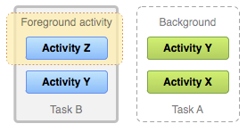

# Intents, Activities, and SharedPreferences
## 1. Understand Tasks and Back Stackbookmark_border
- the task is a set of activities, and the user will interact with

`A representation of how each new activity in a task adds an item to the back stack. When the user presses the Back button, the current activity is destroyed and the previous activity resumes.`

`Two tasks: Task B receives user interaction in the foreground, while Task A is in the background, waiting to be resumed.`

`A single activity is instantiated multiple times.`

`A representation of how an activity with launch mode "singleTask" is added to the back stack. If the activity is already a part of a background task with its own back stack, then the entire back stack also comes forward, on top of the current task.`
## 2. Save key-value databookmark_border
### Get a handle to shared preferences
- you can create shared prefrences file or access an exsiting by calling one of following methods:
  1. `getSharedPreferences()`
  1. `getPreferences()`
i.e `"com.example.myapp.PREFERENCE_FILE_KEY"`: 
```
Context context = getActivity();
SharedPreferences sharedPref = context.getSharedPreferences(
        getString(R.string.preference_file_key), Context.MODE_PRIVATE);
```

i.e `getPreferences() `: 
```
SharedPreferences sharedPref = getActivity().getPreferences(Context.MODE_PRIVATE);

```
- you can call edit() on `SharedPreferences` to create=> SharedPreferences.Editor
- you can read from shared preferces by `getInt()` and `getString()`
ex:
```
SharedPreferences sharedPref = getActivity().getPreferences(Context.MODE_PRIVATE);
int defaultValue = getResources().getInteger(R.integer.saved_high_score_default_key);
int highScore = sharedPref.getInt(getString(R.string.saved_high_score_key), defaultValue);
```
