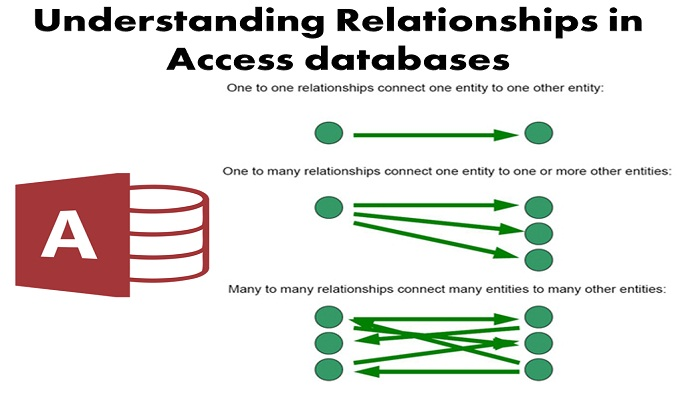

# Room
## 1. Overview: Saving data with Room
- when the application have a structured data, and you want him to use the data even if he's offline you have to use something like caches
- using Room persistence library give a great potenial of dealing with storing data
- there is three main component in room:
   1. The database class => to access the database
   1. Data entities => making the table in database
   1. Data access objects (DAOs) => methods to do the CRUD operations

- [to parctical implemetation in rooms click on me =>](https://developer.android.com/training/data-storage/room)

## 2. Defining entities in Room
- in order to store data you have to make entity to some object
- entity represent a table in data base as in spring framework
- you can define the database schema without writing SQL just by the entity class
[the general idea of entity in easy for someone deal with spring, and for more detail click on me=>](https://developer.android.com/training/data-storage/room/defining-data)

## 3. Related entities in Room
- in this part of reading we talked about the relation between table in the database
- as every SQL database the relations are:
   - one to one relationship
   - one to many relationship
   - many to many relationship
   - nested relationship


## 4. Accessing data with Room
- DAO stands for=>  data access objects
- DAO defined either interface or abstract class
- you have to annotate this interface with `@Dao`
- as you will see in the following code this interface don't have properties, it have methods to access the data in database:   
```
@Dao
public interface UserDao {
    @Insert
    void insertAll(User... users);

    @Delete
    void delete(User user);

    @Query("SELECT * FROM user")
    List<User> getAll();
}
```
- there is two types of Dao methods:
   - Convenience methods (insert, update, delete, get)
   - query methods
- [click here in order to see code implementaion for these concepts=>](https://developer.android.com/training/data-storage/room/accessing-data#java)
