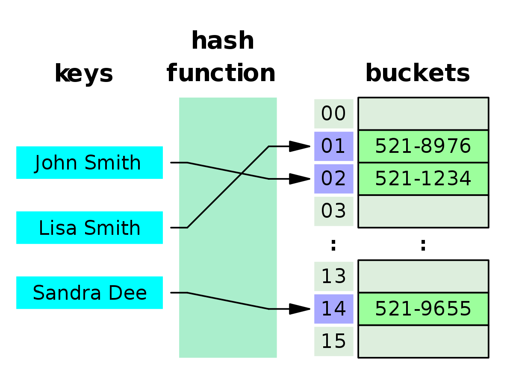
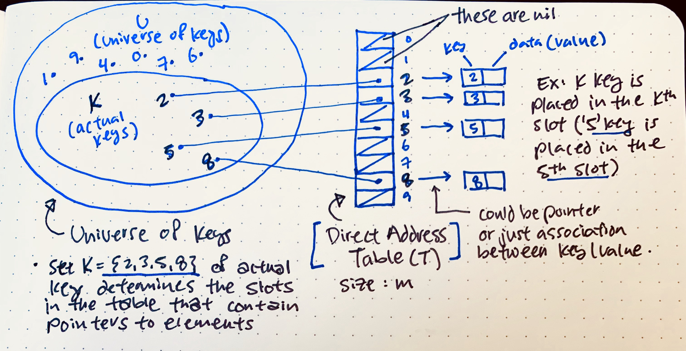

# Hash Tables

- the hash table is a way of storing data inside array as `key` and `values`
- the hash(key)=> refered to index in the array
- the value in array will be in shapes in way or another like circle, square....
- if you try to store a value in filled index it's ok just by using chain=> the previous value in the index will point to the new one "linked list'
- the hashTable used for Hold unique values, Dictionary and Library.
- the Bucket is the index and every one have a key and value
- the hash used to store key value in the known place and after that retriving it in easy way
- th time complexity in O(1) because the hash will retrieve the value directly 
- the hash will store the data not in array indexes order, instead it will store it in a know index, and when retrive it, the index will targeted directrly to get the key, and from it will get the encoded value
- in the following image i find a good explincation for the hash tables

