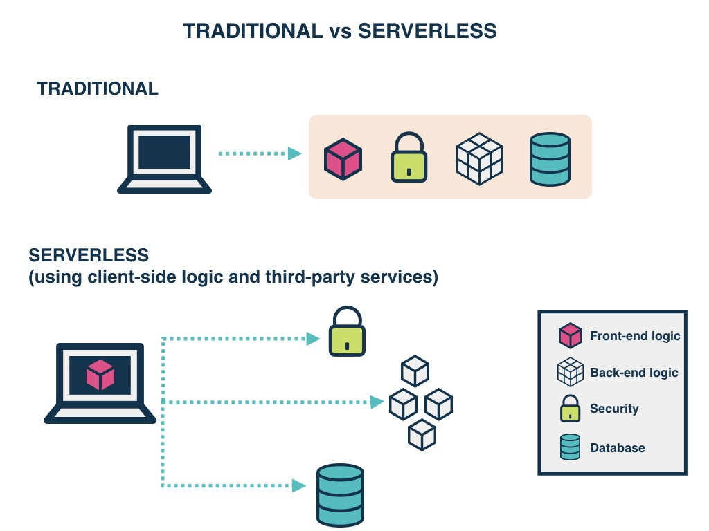

# Serverless and Amplify
- “Focus on your application, not the infrastructure”==> the idea of serverless meant to make the productive attention from the infrastructure to buissness goal, which is really why the application done, if can let all the time for the goal that will be the dream, maybe you will not make all of attention on your goal, but it will spend more time on it.
- serverless as i understood is to cloud computing execution model and it will triger when the request come, and it only will execute if it reseve a request, and after done it will stop working, and there is logic happen on client side.    
   
- from the above image you can see in the way we were working there is a client side and he will do request and sending with it his ip adress, after theat the server side with give hive the html file, css file, js files and  the server logic, and the data from the the database, but in serverless you see the front end logic is from client side and the another part are not just one devise, it's a differnet idea   
- from what i read i can see these note stucking in my mind:
1. the serverless will work when it invoked and it's working will count with MS
1. every sort of application has best way to do it, serverless and it's potential don't mean in any way that the traditional way will dead
1. there is a lot of maintenance work in traditional way, so the serverless it was a happy thing for a lot of programmer
1. when you work in heavy app with a lot of frameworks and libraries it's better to work in the traditional way
1. there is new archticture using serverless `you can see it the bellow image`:
   - database
   - security
   - faas=> funtion a.. a.. service
   - etc 

## GraphQL
- it's a way to transform data to be suitable for AWS, sot the we can say it's our new database application, and with we can make our own schema and transform it and implement it to AWS