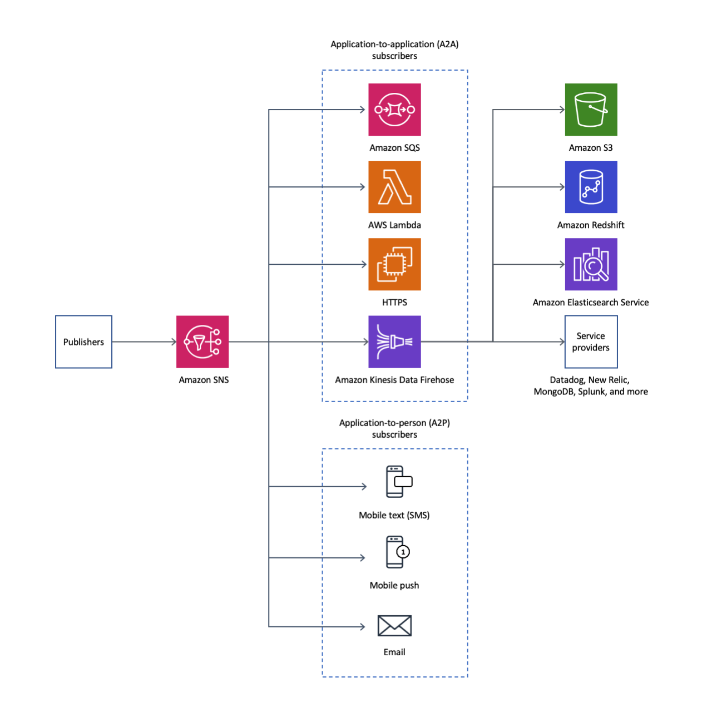

# Notifications     

- sns stands for=> simple notification serviece
- sns provide a low cost infrastructure of delivering messages, and most likely used in mobile applications.
- sns can send to a lot of devices, from the Kindle Fire to Baidu.
- also it can send an sms to more than 200 countries.
- it's use the `publish/subscribe` model for `push delivery` of messages.
## push notification
there is four parts in the reading:
### first: Getting started
- in getting started there is an straightforward steps and it's easy to follow and they are:
   - Set Up The Backend:
   - connect to my backend
### second: Messaging campaigns
the steps are easy and in general i have to do eight things in order to make make the messaging campaigns:
   - add push listner to app
   - configure the manifest
   - run specific command you can found it here [click on me](https://docs.amplify.aws/sdk/push-notifications/messaging-campaign/q/platform/android)
   - provide campaign name and choode the android as platform
   - choose the traget point "one device"
   - provide a title and body for my push notification
   - Choose Immediate
   - launch the campaign
### Third: Setting up push notification services
- the general steps in setting up the push notification:
   - open the app
   - add receiver
   - open deep link
   - creat intent filter
   - handle the intent
- and for handling amazon device massaging push notifications:
   - Integrate the ADM
   - Test the ADM 
