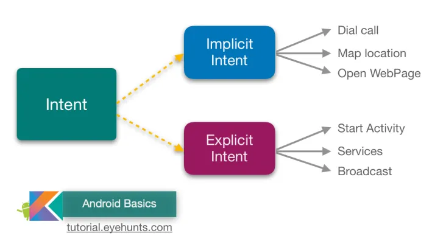
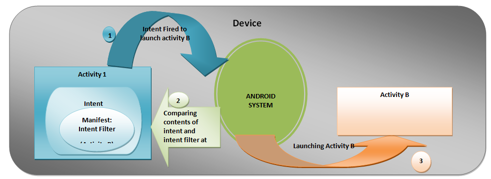

# Intent Filters
- until now we used the intent to do actions in the same application.
- sometimes it's so useful to use intent from to do action that provided from another application
- you can use the intent in order to response to actions from another application
- as an example if you want to share an image, and want the option to share it with your application, at this case you have to use implicit intent.    
     
- in order to use another app action you have to add an intent filter in the manifest, and when you startActivity() or startActivityForResult()===> the system with know wich ativity to response for the intent
- the intent filter have to fullfil these objects:
   - action
   - data
   - category
- in order to 
- in general handling the intent will be on create method             
  