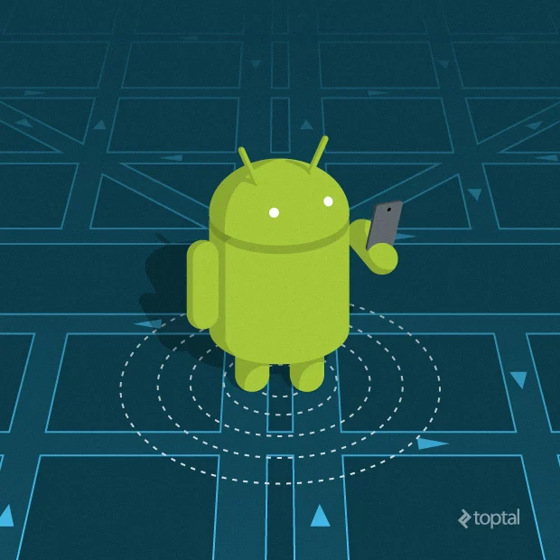

# Location     

- `fused location provider` is used by service in google play.
- the applicatin can get the location from requesting the google play, to get the last location for the device using `getLastLocation()`.
- in order to use the `fused location provider` you have to setup your device and add the google play service provider to your project
- you will create an instance of fused location provider on onCreate method in the application.
- `getLastLocation()` accuracy will depend on the premession provided in the manifest.
- getLastLocation() will return a task to get the location
- there is three cases that the task will return null instead of latitude and longitude:
   - the location is turned off in the device
   - the google play services are retstarted and there is not fused location provider
   - your device in new and the location isn't recorded yet.
- you have to notice that the most recent location don't have to be the most accurated one, and to check that you have to check if it's really update the location and after that to check if this new object has a real diffrent in from the previous one, and if it's really have a diffrence check if it's more accurate that the previous one or not.
- in genral the idea of location not hard at all there is some basic idea you have to undertand and all of steps are straighforward to use, and it's all provided in the documenation [here====>](https://developer.android.com/training/location)