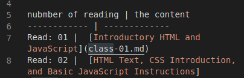
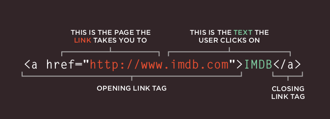
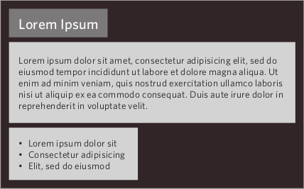
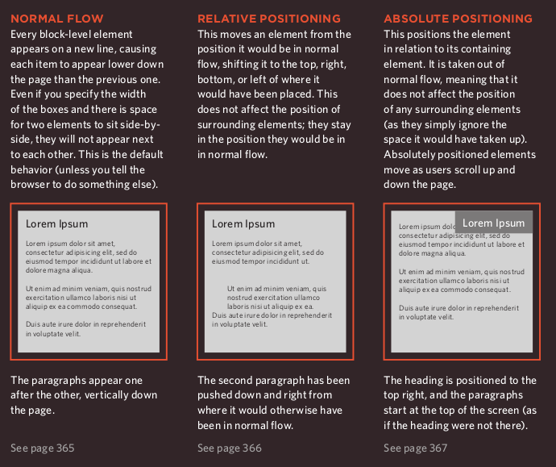
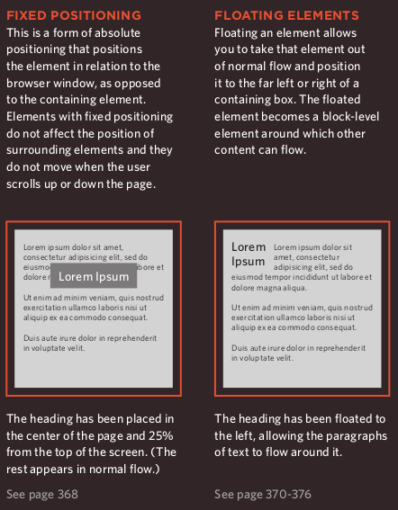

# reading from the Duckett HTML book:
## Chapter 4: Ch.4 “Links” (pp.74-93)
- the main idea of links that you can click on the element in your page to go to another page.
- you could do that throw:
1. URL
1. relatibe directorey if you have the page localy, as you could see in my computer in the following picture.

- the general form of URL links

## Chapter 15: “Layout” (pp.358-404)
- CSS treats each HTML element as if it is in its
own box. This box will either be a block-level
box or an inline box.

- thre are 5 positioning in CSS:
1. Normal flow
1. Relative Positioning
1. Absolute positioning
1. Fixed Positioning
1. Floating Elements

## Chapter 3 (first part): “Functions, Methods, and Objects” (pp.86-99 ONLY)
- quiz: write down the right answer:
1. .......let you group a series of statements together to perform a
specific task.
1. ........ produce a value. They can be used where values are expected.  
1. ........ group together a set of variables and functions to create a model
of a something you would recognize from the real world. I 

***the answers:Functions, Expressions, Objects***
## Article: “6 Reasons for Pair Programming”
- pair programmin is that two persons will work together to make the code:
1. Driver: the one who type the code on the text editor and he will do any think related to using computer directly.
1. Navigator: the one who see the big picure and use his world to help his partner without touchin keyboard.
- there is six benifits of using pair programming:
1. Greater efficiency
2. Engaged collaboration
3. Learning from fellow students
4. Social skills
5. Job interview readiness
6. ....... guess what :)

