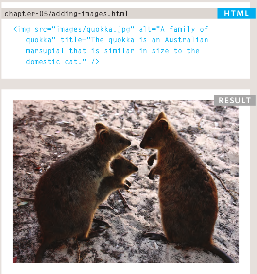
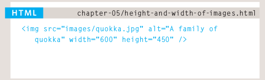
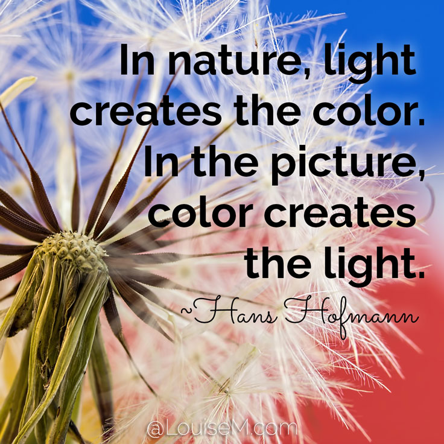
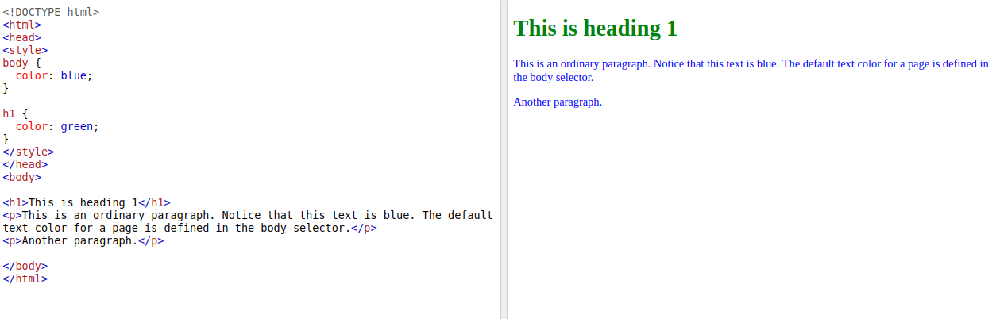
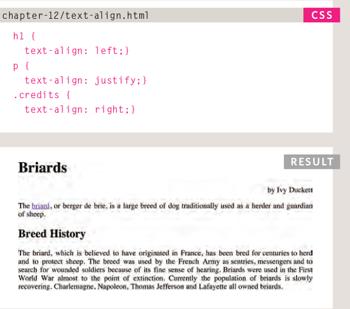
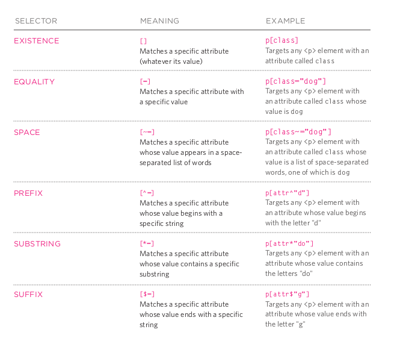

# From the Duckett HTML book:

## Chapter 5: “Images” (pp.94-125)
- A picture can say a thousand words; putting the right picture in the right web site will make a big difference in the web site.
- before using any images make sure that the image dont have a copy right, so you can use free stock photos website like:
1. www.istockphoto.com
1. www.gettyimages.com
1. www.veer.com
1. www.sxc.hu
1. www.fotolia.com
- the image that you will add to your site have to be:
1. relevant
1. Convey information
1. Convey the right mood
1. Be instantly recognisable
1. Fit the color palette
- the general form of adding image.

- and if you want to change it's height and width you could do it easly as the following code:

- test your self with following questions:
1. The HTML ....... tag is used to embed an image in a web page.
1. the best place to insert image is ....... a paragraph
1. Photographs are best saved as .......; illustrations or logos that use flat colors are better saved as .......
## Chapter 11: “Color” (pp.246-263)

*having a good sense of color will make your page amazing and will make any one see it comfortable*
- Every color on a computer screen is created by mixing amounts of red,
green, and blue.
- There are three ways to specify colors in CSS: 
*RGB values, hex codes, and color names*
- adding a color to html file is so direct like you see in the following example:

- test your self with following questions:
1. EF1D1D color in RGB system is .......
1. FFFFFF color in HEX system is .......

## Chapter 12: “Text” (pp.264-299)
- The properties that allow you to control
the appearance of text can be split into
two groups:
1. Those that directly affect the font and its appearance
(including the typeface, whether it is regular, bold or italic,
and the size of the text)
1. Those that would have the same effect on text no matter
what font you were using (including the color of text and
the spacing between words and letters)
- The font-family property
allows you to specify the
typeface that should be used for
any text inside the element(s) to
which a CSS rule applies.
- The font-size property enables
you to specify a size for the
font. There are several ways to
specify the size of a font. The
most common are: 
1. pixels
1. percentage
1. ems
- make your font size about 16 px and another sizes relativly to this value.
- The text-align property allows
you to control the alignment of
text. The property can take one
of four values:
1. left
1. right 
1. center
1. justify

*types of text-align*
- The text-shadow property has
become commonly used despite
lacking support in all browsers.
- Attribute Selectors

- test your reading: 
**You can use ....... to change the style of an
element when a user hovers over or clicks on text, or
when they have visited a link.**

***"the answers of quizes"***
("img", before, JPEGs, GIFs, dark red, white, pseudo-classes)