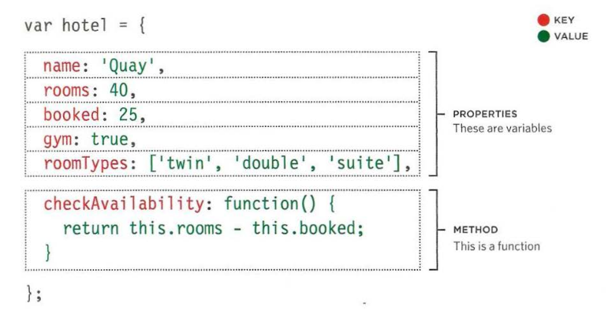
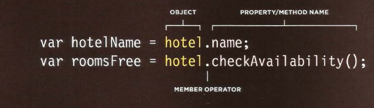

# Read: 06 - JS Object Literals; The DOM

## JS Object Literals
- Object: group functions and variables together.
- when the function be in the object we call it method.
- when the variable be in the object we call it property.
- the following example "hotel" is the object:

- to call an property or method from object you could use two ways as you can see in the figure:

## The DOM

